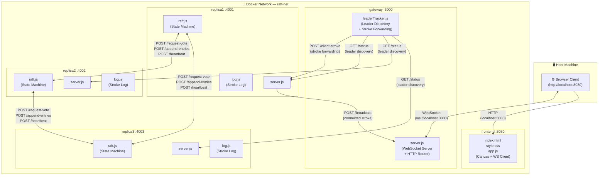
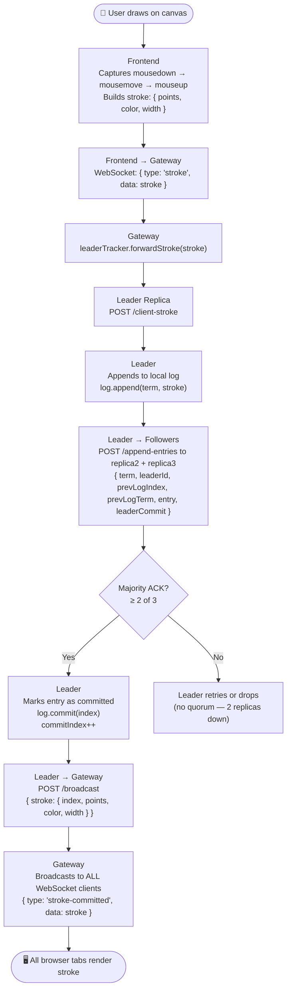
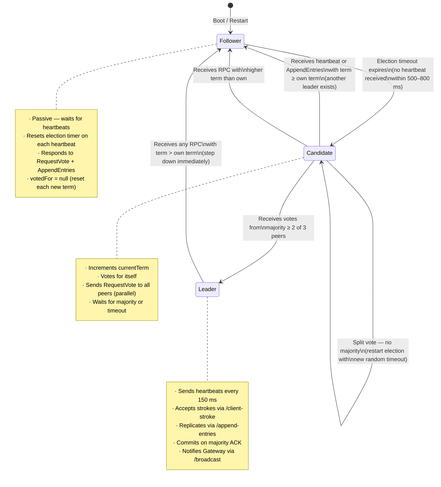
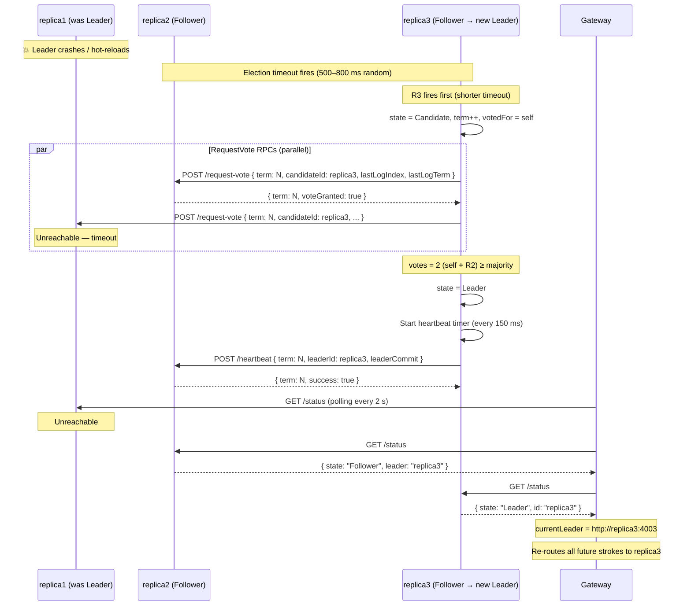
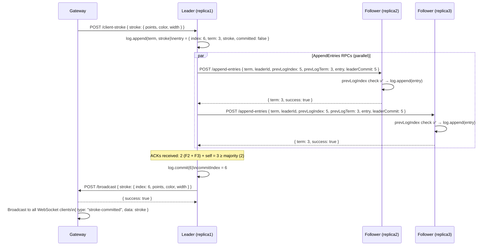
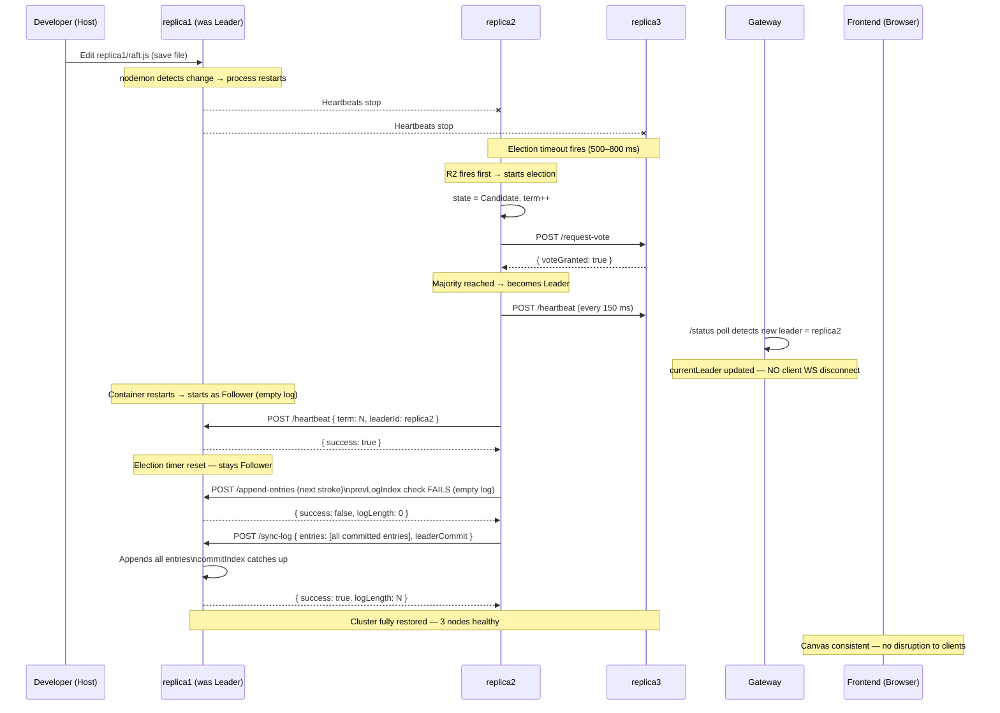
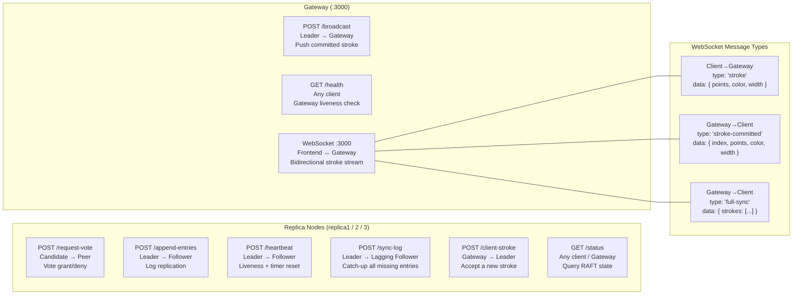
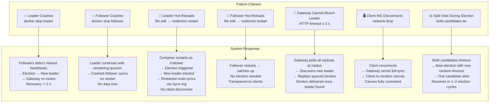

# Architecture Document

## Distributed Real-Time Drawing Board with Mini-RAFT Consensus

| Field             | Detail                                                       |
| ----------------- | ------------------------------------------------------------ |
| **Project Title** | Distributed Real-Time Drawing Board with Mini-RAFT Consensus |
| **Version**       | 1.0                                                          |
| **Date**          | April 2026                                                   |
| **Architecture**  | Microservices (Containerised via Docker)                     |

> **Related Documents:**
> - `SRS_Document.md` — Full functional/non-functional requirements, API specs, protocol spec
> - `Implementation_Plan.md` — Week-wise execution plan, Docker deployment, testing strategy

---

## Table of Contents

1. [Cluster Overview Diagram](#1-cluster-overview-diagram)
2. [End-to-End Stroke Flow](#2-end-to-end-stroke-flow)
3. [Mini-RAFT State Transition Diagram](#3-mini-raft-state-transition-diagram)
4. [Leader Election Sequence](#4-leader-election-sequence)
5. [Log Replication Sequence](#5-log-replication-sequence)
6. [Hot-Reload Failover Sequence](#6-hot-reload-failover-sequence)
7. [API Endpoint Map](#7-api-endpoint-map)
8. [Failure Handling Summary](#8-failure-handling-summary)

---

## 1. Cluster Overview Diagram

All four microservices run inside a shared Docker bridge network (`raft-net`). Only the Gateway and Frontend ports are exposed to the host.



### Port Reference

| Service    | Container  | Host Port | Internal Port | Role                        |
| ---------- | ---------- | --------- | ------------- | --------------------------- |
| Frontend   | `frontend` | `8080`    | `8080`        | Static canvas SPA           |
| Gateway    | `gateway`  | `3000`    | `3000`        | WebSocket + HTTP router     |
| Replica 1  | `replica1` | `4001`    | `4001`        | RAFT consensus node         |
| Replica 2  | `replica2` | `4002`    | `4002`        | RAFT consensus node         |
| Replica 3  | `replica3` | `4003`    | `4003`        | RAFT consensus node         |

---

## 2. End-to-End Stroke Flow

The complete path a drawing stroke takes from the browser to all connected clients.



---

## 3. Mini-RAFT State Transition Diagram

Each replica node is always in exactly one of three states. The transitions are driven by timeouts, RPCs received, and vote counts.



---

## 4. Leader Election Sequence

What happens from the moment a follower stops receiving heartbeats until a new leader is elected.



---

## 5. Log Replication Sequence

How a committed stroke travels from the leader's log to all followers (happy path).



---

## 6. Hot-Reload Failover Sequence

What happens when a source file in a replica's directory is edited on the host — triggering nodemon to restart the container.



---

## 7. API Endpoint Map

Complete reference of all HTTP endpoints and WebSocket messages in the system.



### `/status` Response Shape

All replicas expose the same status response format (SRS §6.1):

```json
{
  "id":          "replica1",
  "state":       "Leader",
  "term":        3,
  "leader":      "replica1",
  "logLength":   5,
  "commitIndex": 5
}
```

---

## 8. Failure Handling Summary

How the system responds to each class of failure, and the expected recovery time.



### RAFT Timing Constants (from `config.js`)

| Parameter              | Value    | Purpose                                    |
| ---------------------- | -------- | ------------------------------------------ |
| Heartbeat Interval     | `150 ms` | Leader → all Followers liveness signal     |
| Election Timeout Min   | `500 ms` | Randomised lower bound for election trigger|
| Election Timeout Max   | `800 ms` | Randomised upper bound for election trigger|
| HTTP RPC Timeout       | `300 ms` | During inter-replica RPC calls             |
| Gateway Leader Timeout | `2000 ms`| Before Gateway initiates re-discovery      |

---

*End of Architecture Document — v1.0*
